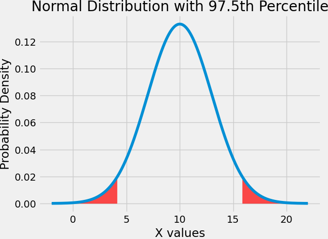
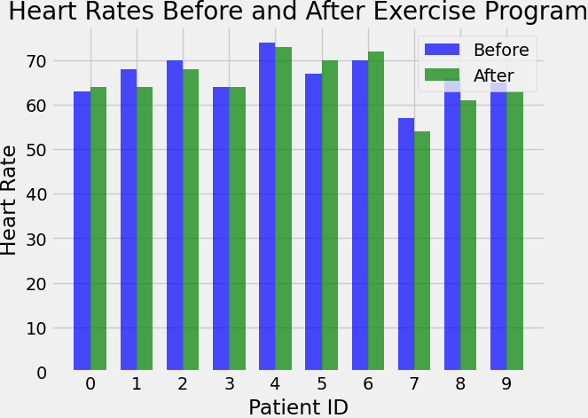

# Applied Statistics Assessment Submission

Welcome to Edward Cronin's repository for the Applied Statistics Module 2024/2025. This repository contains the student's submissions for the module, including detailed tasks and a comprehensive project.

### Overview
This README file is structured into two main sections:

Section 1: Applied Statistics Tasks 2024/2025: This section includes various tasks assigned throughout the module, showcasing the student's understanding and application of statistical concepts and techniques.

Section 2: Applied Statistics Project 2024/2025: This section presents the student's final project, which integrates the knowledge and skills acquired during the course to address a complex statistical problem.

Feel free to explore the repository to see the students' approaches and solutions to the tasks and project. Feedback is always welcome!

### Contents
tasks.ipynb: This file contains four tasks completed as outlined in the Tasks Section of the [2024 Applied Statistics Module README document](https://github.com/ianmcloughlin/2425_applied_statistics/blob/main/README.md).

project.ipynb: This file contains the completed project work as outlined in the Project Section of the [2024 Applied Statistics Module README document](https://github.com/ianmcloughlin/2425_applied_statistics/blob/main/README.md).

### Author
Name: Edward Cronin

Student ID: g00425645

Email: g00425645@atu.ie

## How to download this repository

1. Logon to GitHub to locate the student's specific repository dedicated to this project located at [My repository for Applied Statistics on GitHub]( https://github.com/ECronin1973/Applied_Statistics_MyWork) .
2. Click the download button.
3. To run the code, ensure that python is installed.

## Code of Conduct

A code of conduct governs the use of this repository and has been uploaded within the repository for ease of reference.

## Installation
To install the necessary dependencies, use the following command:
```<bash>
pip install -r requirements.txt
```

## Usage
To run the Jupyter notebooks, navigate to the directory containing the files and use the following command:
```<bash>
jupyter notebook
```

## Dependencies 
The project relies on several Python libraries, which are listed in the requirements.txt file. These include:
- pandas
- numpy
- matplotlib
- seaborn
- scipy
- scikit-learn
Make sure to install these dependencies to ensure the code runs smoothly.

# Tasks 2024/2025 Applied Statistics

## Task 1: Lady Tasting Tea Experiment

### Overview

This project is inspired by the famous "Lady Tasting Tea" experiment, as described in Ronald A. Fisher's book The Design of Experiments. We aim to replicate the experiment with a twist, involving twelve cups of tea, six of which have milk poured in first and the other six have tea poured in first.

### Objective

A person claims to be able to discern whether milk or tea was poured into the cup first just by tasting it. Our objective is to calculate the probability that this person can correctly identify all six cups of milk poured in first, assuming they are merely guessing without any special powers.

### Experiment Setup

- Total Cups: 12
- Milk First: 6 cups
- Tea First: 6 cups

The participant will taste each cup and determine the order in which milk or tea was poured.

## Probability Calculation 

Calculate the probability that the participant correctly identifies all six ‘milk first’ cups by chance.

### Instructions (Probability Calculation):

- Use Python to simulate the experiment.
- Assume the participant is guessing; they do not have any special powers.
- Justify your workings with comments in code cells and explanations in Markdown cells.

**The following code is used to define the relevant variables in the experiment**

```<python>
# Number of cups of tea in total.
no_cups = 12

# Number of cups of tea with milk in first.
no_cups_milk_first = 6

# Number of cups of tea with tea in first.
no_cups_tea_first = 6
```

We next adapt Fisher's table, which outlines four possible categories for results. It formed the basis of the original test and is a model for this test, where we are requiring an individual to correctly identify six cups out of 12.

## Adapting Fishers Table

The following code was used to adapt the Fishers Table.

```<python>
# Make an empty data frame to store the twelve cups
tea_df = pd.DataFrame()

# Insert a column that records whether the milk is poured before the tea into that cup
tea_df['milk_first'] = np.repeat(['yes', 'no'], [6, 6])

# Add a column recording the guesses for the cups where milk was poured first
tea_df['says_milk_first'] = np.repeat(['yes', 'no'], [6, 6])

# Take a sample (without replacement) of 12 rows
tea_df = tea_df.sample(12, replace=False)

# Reset the row labels to throw away the labels showing the original order
tea_df = tea_df.reset_index(drop=True)

# Add an index column to display row numbers
tea_df.index.name = 'Guess No.'

# Create a figure and axis
fig, ax = plt.subplots(figsize=(8, 4))

# Hide the axes
ax.xaxis.set_visible(False)
ax.yaxis.set_visible(False)
ax.set_frame_on(False)

# Create the table
table = ax.table(cellText=tea_df.values, colLabels=tea_df.columns, rowLabels=tea_df.index, cellLoc='center', loc='center')

# Style the table
table.auto_set_font_size(False)
table.set_fontsize(12)
table.scale(1.2, 1.2)

# Save the table as an image
plt.savefig('images/tea_df_table.png', bbox_inches='tight', pad_inches=0)

# Show our reconstruction of the Fisher's table based on 12 random guesses
plt.show()
```

The following is an image of the Fishers Table generated from the above code:

 

## Calculating the Number of ways of selecting six cups from twelve

The math.comb() method returns the number of ways to pick k unordered outcomes from n possibilities without repetition, also known as combinations.  The output was 924.

The following code was used to complete this task: 

```<python>
# Number of ways of selecting six cups from twelve.
ways = math.comb(no_cups, no_cups_milk_first)

# Show.
ways
```

## Ordering the results

We used Python’s itertools library to generate combinations and exported the results to a combinations.csv file.  The following was the output.

Cup labels: [0, 1, 2, 3, 4, 5, 6, 7, 8, 9, 10, 11]
Number of combinations: 924

```<python>
import itertools
import csv

# Define the number of cups
no_cups = 12

# The cup labels
labels = list(range(no_cups))
print("Cup labels:", labels)

# Ensure the variable is defined
no_cups_milk_first = 6

# Generate the combinations
combs = list(itertools.combinations(labels, no_cups_milk_first))

# Write the combinations to a CSV file
with open('combinations.csv', 'w', newline='') as csvfile:
    writer = csv.writer(csvfile)
    writer.writerow(['Combination'])
    for comb in combs:
        writer.writerow([', '.join(map(str, comb))])

# Display the number of combinations
print(f"Number of combinations: {len(combs)}")
```

## Selecting six cups

We selected six cups at random to put milk in first, which gave an output of [1, 2, 3, 5, 6, 11] using the following code:

```<python>
import random

# Select six cups at random to put milk in first.
# https://docs.python.org/3/library/random.html#random.sample
labels_milk = random.sample(labels, 6)

# Sort, inplace.
labels_milk.sort()

# Show.
labels_milk
```

## Define Variables

We ensure variables are defined using the following code, which gave an output {0, 3, 5, 6, 8, 10}:

```<python>
# Ensure the variable is defined
labels_milk = random.sample(labels, 6)
labels_milk.sort()

# Turn labels_milk into a set.
# Uses: https://docs.python.org/3/tutorial/datastructures.html#sets
set(labels_milk)
```

## Calculate Overlap

We calculated the overlap between each element of combs and labels_milk and exported the output into overlaps.csv using the code:

```<python>
# Calculate the overlap between each element of combs and labels_milk.
# Uses: https://docs.python.org/3/library/stdtypes.html#set
import itertools
import csv

no_overlaps = []

# Open a CSV file to write the results
with open('overlaps.csv', 'w', newline='') as csvfile:
    writer = csv.writer(csvfile)
    writer.writerow(['Combination', 'Overlap', 'Length of Overlap'])
    
    for comb in combs:
        # Turn comb into a set
        s1 = set(comb)
        
        # Turn labels_milk into a set
        s2 = set(labels_milk)
        
        # Figure out where they overlap
        overlap = s1.intersection(s2)
        
        # Append overlap to no_overlaps
        no_overlaps.append(len(overlap))
        
        # Write the combination, overlap, and overlap length to the CSV file.  View results in this file.
        writer.writerow([comb, list(overlap), len(overlap)])

 # Show the overlaps from the extracted file
 print(no_overlaps)
 ```

 ## Number of Overlaps

 We next count the number of times each overlap occurs, which gave an output of

 (array([0, 1, 2, 3, 4, 5, 6]), array([ 1, 36, 225, 400, 225, 36, 1], dtype=int64))

 The following code was used:
 
 ```<python>
 import numpy

# Count the number of times each overlap occurs.
counts = np.unique(no_overlaps, return_counts=True)

# Show.
counts
```

## Display results with a Bar Chart

We displayed overlap results within the following bar chart using the code:

 ```<python>
# Create a figure.
fig, ax = plt.subplots(figsize=(6, 6))

# Bar chart.
bars = ax.bar(counts[0], counts[1])

# Display values on top of bars
for bar in bars:
    height = bar.get_height()
    ax.text(bar.get_x() + bar.get_width() / 2., height, f'{height}', ha='center', va='bottom')
# Show the plot
plt.show()
```

 

## Allowing Errors

Consider whether we are willing to accept one error in the participant's selection. After completing this task, I would be willing to accept 5 cups out of 6 as correct, as it has a 3.8 per cent probability of being right. This would mean that the person had a nearly 96.2% chance of getting it wrong.   

### Instructions (One Error):

Calculate the probability that the participant makes at most one error. From completing this task, the Number of Overlaps and its related bar chart shows that a person's chance of getting six correct cups is 1 in 924. The chance of getting five correct cups is 36 in 924. The chance of getting four correct cups is 225 in 924. The chance of getting half the number of cups right is 400 in 924, which is nearly half the time. The chance of getting all six wrong is 1 in 924. It may be the case that the person can tell the difference every time but does not know which group a cup belongs to.

## Accepting Two Errors

Discuss whether accepting two errors would be reasonable and calculate the corresponding probability. From completing this task, Depending on the context, I may be willing to accept four cups, as the person has a near 25% chance of being right or a 1:4 ratio. In other contexts, I would not accept the two errors. I would always strive for a one-error acceptance scenario.   A detailed explanation of the acceptance of two errors is provided below.

### Instructions (Two Errors):

From completing this task, the number of overlaps and its related bar chart shows that a person's chance of getting two errors is 225 / 924, which is approximately 0.2435 or 24%.

In the context of our experiment, we aim to determine whether a participant can accurately identify which cups had milk poured first merely by tasting the tea. If the participant is purely guessing, the results of this experiment can be modelled using combinatorial probability.

### Understanding the Probability Calculation

**Total Combinations:**

There are 12 cups, 6 with milk poured first, and 6 with tea poured first.

The number of ways to select 6 cups out of 12 (regardless of order) is calculated using the combination formula.

$$ \binom{n}{k} $$

The total number of possible combinations is calculated as:

$$
\binom{12}{6} = \frac{12!}{6! \times 6!} = 924 
$$

Viewing the calculation shows there are 924 different ways to choose 6 cups out of 12.

### Calculating Overlaps

The overlap calculation involves determining how many of the chosen 6 cups correctly identify the cups where milk was poured first.

For each possible combination of 6 cups, we evaluate how many of those cups are correctly identified (overlap).

### Probability of Correctly Identifying All Cups

This extremely low probability indicates that getting all 6 correct by guessing is highly unlikely.

### Allowing Two Errors

We extend our analysis to consider if the participant makes at most two errors, meaning they correctly identify 4 or 5 out of 6 cups.

From our combination calculations, the number of ways to achieve different overlap counts is as follows:

| Correct Guesses | Number of Ways |
|-----------------|----------------|
| 0               | 1              |
| 1               | 36             |
| 2               | 225            |
| 3               | 400            |
| 4               | 225            |
| 5               | 36             |
| 6               | 1              |

The chance of correctly identifying all 6 cups purely by guessing is:

$$
\frac{1}{924} \approx 0.00108 \text{ or } 0.108\%
$$

### Rationale for Accepting Two Errors

Given the distribution of the overlaps, allowing two errors (4 out of 6 correct) increases the likelihood of a participant's success from a mere 0.108% (for all correct) to 24.35%.  This is significant.

However, the statistics still imply that getting 4 correct by guessing is relatively rare but within a more plausible range compared to getting all 6 correct.

### Implications

If we observe an individual consistently identifying 4 out of 6 cups correctly (allowing for two errors), it would be reasonable to suspect that they might have some ability beyond mere guessing.

This margin of error provides a more realistic benchmark for assessing the participant's discerning ability while accounting for the task's inherent challenge.

In conclusion, this detailed analysis demonstrates the significantly higher probability of the participant getting two errors in their guesses.  Allowing for two errors may be a more lenient and practical measure of assessing the participant's claimed ability to discern the order of milk pouring in the tea cups. In some contexts, this approach balances the strictness of requiring perfect accuracy with the practicalities of human error and the inherent challenge of the task.  In other contexts, like ensuring children's safety, it would not be prudent to do so.  Sticking to the stringent "5 out of 6" rule ensures this test maintains high power and reliability, reducing the likelihood of erroneously accepting someone's claimed ability. In high-stakes settings, this higher power and lower error risk are essential. Balancing rigour and reliability ensures meaningful and trustworthy outcomes in data analytics.

## Summary Task 1

I have just completed this task, investing considerable time in reviewing the instructor's lectures and setting up my environment with the necessary libraries. After not using Anaconda for over 12 months, I had to delete and reinstall it with VS-Code and add the Copilot AI extension. I also watched YouTube videos (listed in references) to learn how to use the Copilot AI tool. Additionally, I revised how to create README files and use Markdown language.

In the lecture videos, I discovered various methods of calculating the total number of combinations. To deepen my understanding, I referred to other sources such as www.w3schools.com. Python for Data Analytics gave me a solid grasp of using Python, plotting, and visualization. To ensure all bases were covered, I included each method in my task as demonstrated by the instructor, adding relevant notes to each section for context.

**Further Reading Performed**

I explored research on this topic conducted by others. On the site https://lisds.github.io/textbook/wild-pandas/fishers_tea.html, it was noted that 'Muriel guessed correctly for each of the eight cups, and so correctly identified all four milk-first cups'. This test was not performed on an individual but outlined the necessary parameters for a test, comparing 'real-world' results versus the null hypothesis. I analyzed the code on that site and adapted it to display Fisher's table with 12 cups of tea. The four categories outlined in that experiment are also relevant in this test.

I viewed the code in Github and found the printed results too long. Instead, I researched how to extract the results into CSV files. I generated two files: 1. combinations.csv, which was created to collect the combinations and count them, and 2. overlaps.csv, which contained the combination, overlap, and length of overlap between each element of combs and labels_milk. I took this approach to ensure the tasks.ipynb file became readable.

## References

The following online resources were used to complete Task 1 in `tasks.ipynb` and compile content in the Task 1 section of the `README.md` document:

1. [ATU Lectures - Applied Statistics, Dr Ian McLoughlin](https://vlegalwaymayo.atu.ie/course/view.php?id=10454)
2. [Writing README.md files on GitHub](https://help.github.com/en/articles/basic-writing-and-formatting-syntax)
3. [Creating tables in Markdown](https://www.makeuseof.com/tag/create-markdown-table/)
4. [Python Documentation - `math.comb`](https://docs.python.org/3/library/math.html#math.comb)
5. [W3Schools - `math.comb`](https://www.w3schools.com/python/ref_math_comb.asp)
6. [W3Schools - `numpy.random.binomial`](https://www.w3schools.com/python/numpy/numpy_random_binomial.asp)
7. [Python Documentation - `math.factorial`](https://docs.python.org/3.12/library/math.html#math.factorial)
8. [Python Documentation - `itertools.combinations`](https://docs.python.org/3/library/itertools.html#itertools.combinations)
9. [Understanding Error Types in Data Analytics](https://en.wikipedia.org/wiki/Type_I_and_type_II_errors#Table_of_error_types)
10. [Understanding Power in Data Analytics](https://en.wikipedia.org/wiki/Power_(statistics)#Description)
11. [Images Not Displaying in GitHub](https://stackoverflow.com/questions/41468951/images-not-displaying-in-github-pages)
12. [GitHub Copilot in VS Code](https://code.visualstudio.com/docs/copilot/overview)
13. [GitHub Documentation - About READMEs](https://docs.github.com/en/repositories/managing-your-repositorys-settings-and-features/customizing-your-repository/about-readmes)
14. [Further Information on The Design of Experiments](https://en.wikipedia.org/wiki/The_Design_of_Experiments)
15. [Fisher's Tea Experiment](https://lisds.github.io/textbook/wild-pandas/fishers_tea.html)
16. *Python for Data Analysis*, Wes McKinney, O'Reilly, Third Edition
17. [GitHub - About READMEs](https://docs.github.com/en/repositories/managing-your-repositorys-settings-and-features/customizing-your-repository/about-readmes)
18. [PEP 8 – Style Guide for Python Code](https://peps.python.org/pep-0008/)

# END

# Task 2: Assessing Normality of `numpy.random.normal()`

## Overview
In this task, we will assess whether `numpy.random.normal()` properly generates normal values. We will generate a sample of 100,000 values with a mean of 10.0 and a standard deviation of 3.0. We will then use the `scipy.stats.shapiro()` function to test for normality and visualize the results.

## Steps

# Import relevant Libraries for Completion of Task Two
```<python>
# Numerical structures and operations.  This tool is essential for numerical computing. 
# It supports arrays, matrices, and functions for high-level mathematical operations
# https://numpy.org/doc/stable/reference/index.html#reference
import numpy as np 

# The shapiro function comes under the statistical tests grouping in the scipy.stats module.
# This tool is essential for testing the normality of a dataset. It is beneficial in determining whether a sample comes from a normally distributed population.
# The shapiro function performs the Shapiro-Wilk test for normality. It returns a test statistic and a p-value, which you can use to decide whether to reject the null hypothesis that the data is normally distributed.
# https://docs.scipy.org/doc/scipy/reference/generated/scipy.stats.shapiro.html
from scipy.stats import shapiro

# Plotting.  This is a 2D plotting library that is an excellent tool for plotting graphs and visualisation of data.
# https://matplotlib.org/stable/contents.html
import matplotlib.pyplot as plt

# The norm function falls under the probability distributions grouping in the scipy.stats module.
# This tool is essential for working with the normal (Gaussian) distribution. It i widely used in statistics for modelling and analyzing data that follows a normal distribution.
# The norm function provides a range of methods to work with the normal distribution, including calculating probabilities, generating random samples, and fitting data to a normal distribution.
# https://docs.scipy.org/doc/scipy/reference/generated/scipy.stats.norm.html
from scipy.stats import norm
```

### 1. Generate a Sample

Use the `numpy.random.normal()` function to generate a sample of 100,000 values with a mean of 10.0 and a standard deviation of 3.0.

```<python>
## Generate the Random Normal Sample:
# https://numpy.org/doc/stable/reference/random/generated/numpy.random.normal.html#numpy-random-normal
# The numpy.random.normal function generates random samples from a normal (Gaussian) distribution. You can specify the mean and standard deviation of the distribution, as well as the number of samples to generate.

import numpy as np

# Generate a sample of 100,000 values with a mean of 10.0 and a standard deviation of 3.0
mean = 10.0
std_dev = 3.0
sample_size = 100000
sample = np.random.normal(mean, std_dev, sample_size)

# show
sample
```

### Initial Visualisation of Data

Create a histogram of the sample values and overlay the probability density function (PDF) of a normal distribution with the same mean and standard deviation.  The output was exported to histogram_plot.png and is displayed below.

```<python>
# Generate sample data (example)
sample = norm.rvs(size=100000)

# Plot histogram of the sample
plt.hist(sample, bins=50, edgecolor='black', density=True, alpha=0.8, color='g')

# Save the plot as an image in the 'images' directory
plt.savefig('images/histogram_plot.png', bbox_inches='tight', pad_inches=0)

# Show the plot
plt.show()

```

 

*Visualisation of Data Source: images\histogram_plot.png*


### Test for Normality

Three tests are performed to test for Normality, QQ-Plot, Shapiro-Wilk Test and Kolmogorov-Smirnov Test.  Each test will evaluate if the results come from a normal distribution.

### Shapiro-Wilk Test

Apply the scipy.stats.shapiro() function to test if your sample comes from a normal distribution. The function will return a test statistic and a p-value.

```<python>

## Perform the Shapiro-Wilk test for normality
stat, p_value = shapiro(sample[:100000])  # Shapiro test is sensitive to sample sizes > 5000
print(f"Shapiro-Wilk Test: Stat={stat}, p-value={p_value}")
```

### Interpret the output from the Shapiro-Wilk test. 

If the p-value is more significant than 0.05, it suggests that the sample likely comes from a normal distribution. Conversely, a p-value less than 0.05 suggests non-normality. Shapiro-Wilk Test: Stat=0.9998655902986548, p-value=0.8588521744759859 

### QQ-Plot Test ###

Create a Q-Q (Quantile-Quantile) plot to test whether the dataset follows a normal distribution.  The Q-Q plot image was saved s qq_plot.png and is displayed below.

```<python>
from scipy import stats

# Create an empty plot 
fig, ax = plt.subplots() 

# Create a Q-Q plot 
stats.probplot(sample, dist='norm', plot=ax) 

# Save the plot as an image in the 'images' directory 
plt.savefig('images/qq_plot.png', bbox_inches='tight', pad_inches=0) 

# Show the plot (optional) 
plt.show()
```
 

*Q-Q Plot Image Source: images\qq_plot.png*


### Kolmogorov-Smirnov Test

The kstest function will return a test statistic and a p-value. If the p-value is more significant than 0.05, it suggests that the sample likely comes from a normal distribution. Conversely, a p-value less than 0.05 suggests non-normality.  Output to Kolmogorov-Smirnov Test: Stat=0.0032511838823213735, p-value=0.24055406131498747


```<python>
import numpy as np

mean = 10.0
std_dev = 3.0
sample_size = 100000
sample = np.random.normal(mean, std_dev, sample_size)

from scipy.stats import kstest

# Perform Kolmogorov-Smirnov test for normality
stat, p_value = kstest(sample, 'norm', args=(mean, std_dev))
print(f"Kolmogorov-Smirnov Test: Stat={stat}, p-value={p_value}")
```

### Integration Test

The 97.5th percentile test determines if 95% of the area under the normal distribution lies within 1.96 standard deviations away from the mean.  A plot is displayed below to display the results of the following code 

```<python>
import numpy as np
import matplotlib.pyplot as plt
from scipy import stats

# Generate a sample of 100,000 values with a mean of 10.0 and a standard deviation of 3.0
mean = 10.0
std_dev = 3.0
sample_size = 100000
sample = np.random.normal(mean, std_dev, sample_size)

# Create a blank plot
fig, ax = plt.subplots()

# X values
x = np.linspace(mean - 4*std_dev, mean + 4*std_dev, 1000)

# Plot the normal distribution
plt.plot(x, stats.norm.pdf(x, mean, std_dev))

# Shade in the 97.5th percentile
plt.fill_between(x, stats.norm.pdf(x, mean, std_dev), where=(x < mean - 1.96*std_dev) | (x > mean + 1.96*std_dev), color='red', alpha=0.7)

# Add titles and labels
plt.title('Normal Distribution with 97.5th Percentile')
plt.xlabel('X values')
plt.ylabel('Probability Density')

# Save the plot as an image in the 'images' directory 
plt.savefig('images/normal_distribution_97.5th_percentile.png', bbox_inches='tight', pad_inches=0)

# Show the plot
plt.show()
```

 

*normal_distribution_97.5th_percentile Image Source: images/normal_distribution_97.5th_percentile.png*


## Summary of Analysis

According to the website [STATOLOGY](https://www.statology.org/normality-test-python/), there are four common ways to test for Normality in Python.

1. (Visual Method) Create a Histogram.

If the histogram is roughly "bell-shaped," then the data is assumed to be normally distributed. In this case, the histogram is bell-shaped.

2. (Visual Method) Create a Q-Q plot.

If the points in the plot roughly fall along a straight diagonal line, then the data is assumed to be normally distributed. In this case, the points plot roughly along a straight diagonal line.

3. (Formal Statistical Test) Perform a Shapiro-Wilk Test.

If the test's p-value is greater than α = .05, then the data is assumed to be normally distributed. The p-value in this test is (p-value)=0.35617671455482214, so it is greater than .05.

4. (Formal Statistical Test) Perform a Kolmogorov-Smirnov Test.

If the test's p-value is greater than α = .05, then the data is assumed to be normally distributed. The p-value in this test is (p-value) 0.7485155595727593, so it is greater than 0.05.

5. Integration Test.  

95% of the area under the normal distribution was within 1.96 standard deviations away from the mean.

Based on the results of the above tests, the sample is likely normally distributed.

## Further Reading Performed

In order to complete this task, I did the following tasks:

I performed a Google search on testing for Normality in Python.  The website Statology gave me a good approach in conjunction with the great instruction I received when completing the online ATU lectures. 

I identified a helpful youtube video titled 'Normality test - Simply explained'.  This video taught me the following.

a. There are two ways to test for normal distribution: 1. Analytical and 2. Graphically. 

b. Three tests are identified for Analytical testing: 1. Shapiro-Wilk Test, 2. Kolmogorov-Smirnov Test and 3. Anderson-Darling Test. 

c. The objective of each test is to determine if the p-value is smaller than 0.05. If it is smaller, the Normal Distribution is not assumed. If it is greater than 0.05, we assume a normal distribution.    

d. The disadvantage of analytical testing is that the calculated p-value depends on the sample size (the more significant the sample, the smaller the potential p-value). 

e. With a very large sample, the p-value could be smaller than 0.05, rejecting the null hypothesis that it is a normal distribution. 

f. To get around this problem, graphical normal distribution tests are used.  

g. For graphical tests, we either look at the histogram or QQ-Plot. 

h. If we use the histogram, we plot the normal distribution in the data histogram to see whether the curve of the normal distribution roughly corresponds to that of the normal distribution curve.

i. The QQ-Plot is helpful for comparing a perfectly normally distributed dataset's theoretical quantiles with the measured values' quantiles. If the data is perfectly normally distributed, all points will lie on the line. The more the data deviates from the line, the less normally distributed it is.

j. In addition, data that plots the 95% interval — if all your data lies within this interval — is a very strong indication that the data is normally distributed.

The 95% interval was further explored in Wikipedia (97.5th percentile point) which states in probability and statistics, the 97.5th percentile point of the standard normal distribution is a number commonly used for statistical calculations. The approximate value of this number is 1.96, meaning that 95% of the area under a normal curve lies within approximately 1.96 standard deviations of the mean.    

## Libraries Used

**NumPy**: Essential for numerical computing with support for arrays, matrices, and high-level mathematical operations.
[NumPy Documentation](https://numpy.org/doc/stable/reference/index.html#reference)

  ```python
  import numpy as np
  ```

 **SciPy (shapiro)**: Used for testing the normality of a dataset with the Shapiro-Wilk test, providing a test statistic and p-value.
 [SciPy Shapiro Documentation](https://docs.scipy.org/doc/scipy/reference/generated/scipy.stats.shapiro.html)

  ```python
  from scipy.stats import shapiro
  ```
 
 **Matplotlib**: A 2D plotting library for creating graphs and visualizing data.
 [Matplotlib Documentation](https://matplotlib.org/stable/contents.html)

 ```python
  import matplotlib.pyplot as plt
  ```

**SciPy (norm)**: Used for working with the normal (Gaussian) distribution, including calculating probabilities and generating random samples.
 [SciPy Norm Documentation](https://docs.scipy.org/doc/scipy/reference/generated/scipy.stats.norm.html)

 ```python
  from scipy.stats import norm
  ```

## References

The following online resources were used to complete Task 2 in `tasks.ipynb` and compile content in the Task 2 section of the `README.md` document:

1. [ATU Lectures - Applied Statistics, Dr Ian McLoughlin](https://vlegalwaymayo.atu.ie/course/view.php?id=10454)
2. [Writing README.md files on GitHub](https://help.github.com/en/articles/basic-writing-and-formatting-syntax)
3. [Creating tables in Markdown](https://www.makeuseof.com/tag/create-markdown-table/)
4. [NumPy Documentation - `numpy.random.normal`](https://numpy.org/doc/stable/reference/random/generated/numpy.random.normal.html)
5. [NumPy Documentation - `numpy.histogram`](https://numpy.org/doc/stable/reference/generated/numpy.histogram.html)
6. [Normal Distribution - Wikipedia](https://en.wikipedia.org/wiki/Normal_distribution)
7. [Matplotlib Documentation - `matplotlib.pyplot.hist`](https://matplotlib.org/stable/api/_as_gen/matplotlib.pyplot.hist.html)
8. [Statsmodels Q-Q Plot](https://www.statsmodels.org/stable/generated/statsmodels.graphics.gofplots.qqplot.html)
9. [SciPy Documentation - `scipy.stats.shapiro`](https://docs.scipy.org/doc/scipy/reference/generated/scipy.stats.shapiro.html)
10. [SciPy Documentation - `scipy.stats.kstest`](https://docs.scipy.org/doc/scipy/reference/generated/scipy.stats.kstest.html)
11. [Normality test - Simply Explained](https://www.youtube.com/watch?v=AVketBmpUTE)
12. [97.5 th Percentile Point](https://en.wikipedia.org/wiki/97.5th_percentile_point)
13. [GitHub - About READMEs](https://docs.github.com/en/repositories/managing-your-repositorys-settings-and-features/customizing-your-repository/about-readmes)
14. [PEP 8 – Style Guide for Python Code](https://peps.python.org/pep-0008/)


# END

# Task 3: t-Test Calculation

## Overview

### Analysis of Resting Heart Rates Before and After Exercise Program

## Dataset

This task will consider the following dataset, which contains resting heart rates for patients before and after embarking on a two-week exercise program.

| Patient ID | 0  | 1  | 2  | 3  | 4  | 5  | 6  | 7  | 8  | 9  |
|------------|----|----|----|----|----|----|----|----|----|----|
| Before     | 63 | 68 | 70 | 64 | 74 | 67 | 70 | 57 | 66 | 65 |
| After      | 64 | 64 | 68 | 64 | 73 | 70 | 72 | 54 | 61 | 63 |

## Objective

Calculate the t-statistic based on this dataset using Python. Compare it to the value given by `scipy.stats`. Explain the work and list any sources used.

## Task Requirements

1. Calculate the differences between the before and after values.
2. Compute the mean and standard deviation of the differences.
3. Calculate the t-statistic using the formula: 

$$ t = \frac{\bar{d}}{s_d / \sqrt{n}} $$

where:

- $\bar{d}$ is the mean of the differences,

- $s_d$ is the standard deviation of the differences,

- $n$ is the number of observations.

4. Use `scipy.stats` to verify the t-statistic.

## Relevant Libraries Imported For Completing Task 3

```python
# Numerical structures and operations.  This tool is essential for numerical computing. 
# It supports arrays, matrices, and functions for high-level mathematical operations
# https://numpy.org/doc/stable/reference/index.html#reference
import numpy as np 

# The stats function comes under the statistical tests grouping in the scipy.stats module.
# This tool is essential for testing the normality of a dataset. It is beneficial in determining whether a sample comes from a normally distributed population.
# The stats function performs various statistical tests, including the Shapiro-Wilk test for normality, the Kolmogorov-Smirnov test for normality, and many others.
# https://docs.scipy.org/doc/scipy/reference/stats.html
from scipy.stats import stats

# Plotting is a 2D plotting library that is an excellent tool for plotting graphs and visualisation of data.
# https://matplotlib.org/stable/contents.html
import matplotlib.pyplot as plt
```

## Steps to Complete the Task

- Gather Before and After Data
- Calculate the Differences
- Compute the Mean and Standard Deviation of the Differences
- Calculate the t-statistic
- Use scipy.stats to Verify the t-statistic

```<python>
import numpy as np 
from scipy import stats

# Data
# https://numpy.org/doc/stable/reference/generated/numpy.array.html
before = np.array([63, 68, 70, 64, 74, 67, 70, 57, 66, 65])
after = np.array([64, 64, 68, 64, 73, 70, 72, 54, 61, 63])

# Step 1. Calculate the differences
# https://numpy.org/doc/stable/reference/generated/numpy.subtract.html
# This code calculates the difference between the heart rates before and after the exercise program for each patient. The result is stored in the differences array.
differences = before - after

# Step 2. Compute the mean and standard deviation of the differences
# https://numpy.org/doc/stable/reference/generated/numpy.mean.html
# https://numpy.org/doc/stable/reference/generated/numpy.std.html
# mean_diff: This calculates the mean (average) of the differences.
# std_diff: This calculates the standard deviation of the differences. The ddof=1 parameter is used to calculate the sample standard deviation.
# n: This stores the number of observations (patients).
mean_diff = np.mean(differences)
std_diff = np.std(differences, ddof=1)  # ddof=1 for sample standard deviation
n = len(differences)

# Step 3. Calculate the t-statistic
# https://numpy.org/doc/stable/reference/generated/numpy.sqrt.html
# This code calculates the t-statistic using the formula: t = mean_diff / (std_diff / sqrt(n))
t_statistic = mean_diff / (std_diff / np.sqrt(n))
print(f"Calculated t-statistic: {t_statistic}")

# Step 4. Use scipy.stats to verify the t-statistic
# https://docs.scipy.org/doc/scipy/reference/generated/scipy.stats.ttest_rel.html
t_statistic_scipy, p_value = stats.ttest_rel(before, after)
print(f"scipy.stats t-statistic: {t_statistic_scipy}, p-value: {p_value}")
```

## Results

- Calculated t-statistic: 1.3372274824806283
- scipy.statst-statistic: 1.337227482480628
- p-value: 0.21396011317404623

## Initial Analysis of Values

t-statistic: A t-statistic of 1.337 suggests that the mean difference between the before and after heart rates is 1.337 standard deviations away from zero.
p-value: A p-value of approximately 0.214 indicates a 21.4% chance that the differences observed are due to random variation rather than a true effect of the exercise program. This p-value is greater than the common significance level of 0.05, indicating that the observed differences are not statistically significant.

## Analysis Utilizing Various Charts

### Generate Bar Chart

A bar chart was generated using the following code and is displayed below.

```<python>
x = np.arange(len(before))
width = 0.35  # the width of the bars

fig, ax = plt.subplots()
bars_before = ax.bar(x - width/2, before, width, label='Before', color='blue', alpha=0.7)
bars_after = ax.bar(x + width/2, after, width, label='After', color='green', alpha=0.7)

ax.set_xlabel('Patient ID')
ax.set_ylabel('Heart Rate')
ax.set_title('Heart Rates Before and After Exercise Program')
ax.set_xticks(x)
ax.set_xticklabels(range(len(before)))
ax.legend()

# Save the plot as an image in the 'images' directory 
plt.savefig('images/heart_rates_comparison.png', bbox_inches='tight', pad_inches=0)

plt.show()
```

 

*Heart Rates Comparison Image Source: images/heart_rates_comparison.png*

### Generate Line Plot

A line plot was generated using the following code and is displayed below.

```<python>
# Line Plot will display the before and after heart rates for each patient

# Create a Figure and Plot Data:
plt.figure()
plt.plot(range(len(before)), before, marker='o', linestyle='-', color='blue', label='Before')
plt.plot(range(len(after)), after, marker='o', linestyle='-', color='green', label='After')

# Set Titles and Labels:
plt.xlabel('Patient ID')
plt.ylabel('Heart Rate')
plt.title('Heart Rates Before and After Exercise Program')
plt.legend()

# Save the Plot as an Image File in the images Directory:
plt.savefig('images/heart_rates_comparison_line_plot.png', bbox_inches='tight', pad_inches=0)

# Show the Plot
plt.show()
```

 

*Heart Rates Comparison Line Plot Image Source: images\heart_rates_comparison_line_plot.png*

### Generate Scatter Plot

A scatter plot was generated using the following code and is displayed below.

```<python>
# Create a figure 
plt.figure() 

# Create scatter plots 
plt.scatter(range(len(before)), before, color='blue', label='Before') 
plt.scatter(range(len(after)), after, color='green', label='After') 

# Set titles and labels 
plt.xlabel('Patient ID') 
plt.ylabel('Heart Rate') 
plt.title('Heart Rates Before and After Exercise Program') 
plt.legend() 

# Save the plot as an image in the 'images' directory 
plt.savefig('images/heart_rates_comparison_scatter_plot.png', bbox_inches='tight', pad_inches=0) 

# Show the plot 
plt.show()
```

 

*Heart Rates Comparison Scatter Plot Image Source: images\heart_rates_comparison_scatter_plot.png*

### Generate Histogram

A Histogram was generated using the following code and is displayed below.

```<python>
# Create a figure
plt.figure(figsize=(10, 6))

# Plot histograms
plt.hist(before, bins=10, color='blue', alpha=0.5, label='Before', edgecolor='black')
plt.hist(after, bins=10, color='green', alpha=0.5, label='After', edgecolor='black')

# Set titles and labels
plt.title('Histogram of Heart Rates Before and After Exercise Program')
plt.xlabel('Heart Rate')
plt.ylabel('Frequency')
plt.legend()

# Save the plot as an image in the 'images' directory
plt.savefig('images/heart_rates_histogram.png', bbox_inches='tight', pad_inches=0)

# Show the plot (optional)
plt.show()

```

 

*Heart Rates Comparison Histogram Image Source: images\heart_rates_histogram.png*

### Generate Box Plot

A Box Plot was generated using the following code and is displayed below

```<python>
# Box Plot is useful as it shows the distribution of heart rates before and after the exercise program, as well as any outliers.
plt.figure(figsize=(10, 6))
plt.boxplot([before, after], labels=['Before', 'After'], patch_artist=True,
            boxprops=dict(facecolor='lightblue', color='blue'),
            medianprops=dict(color='red'))

# Add titles and labels
plt.title('Box Plot of Heart Rates Before and After Exercise Program')
plt.xlabel('Condition')
plt.ylabel('Heart Rate')

# Save the Plot as an Image File in the images Directory
plt.savefig('images/heart_rates_box_plot.png', bbox_inches='tight', pad_inches=0)

# Show the plot
plt.show()
```

 

*Heart Rates Comparison Box Plot Image Source: images\heart_rates_box_plot.png*


## Conclusion

The results of t-statistic scipy.stats are the same.  Taking both the plots' results and images indicates that the observed differences are not statistically significant.

## Assumptions

The t-test makes five key assumptions:

1. Paired Samples
The t-test assumes that the data consists of paired samples. In this case, each patient's heart rates before and after the exercise program are paired.

2. Normality
The differences between the paired samples (before and after values) should be normally distributed This assumption is crucial for the validity of the t-test results.

3. Independence
The pairs of observations (before- and after-values for each patient) should be independent of each other This means that one patient's heart rate measurements should not influence another's measurements.

4. Scale of Measurement
The data should be measured on an interval or ratio scale. In this case, heart rates are measured on a ratio scale appropriate for the t-test.

5. No Significant Outliers
Significant outliers should not exist in the differences between the paired samples, as outliers can affect the t-test results.

These assumptions ensured the validity and reliability of the t-test results. If any of these assumptions were violated, the results would not be accurate.

## Libraries Used

The following libraries were used in Task 3:
NumPy: Essential for numerical computing. It supports arrays, matrices, and functions for high-level mathematical operations.
SciPy: Provides functions for statistical tests, including the paired t-test.
Matplotlib: A 2D plotting library for creating graphs and visualizations.
These libraries are crucial for performing the calculations and visualizations required in this task.

## References

The following online resources were used to complete Task 3 in `tasks.ipynb` and compile content in the Task 3 section of the `README.md` document:

1. [ATU Lectures - Applied Statistics, Dr Ian McLoughlin](https://vlegalwaymayo.atu.ie/course/view.php?id=10454)
2. [Writing README.md files on GitHub](https://help.github.com/en/articles/basic-writing-and-formatting-syntax)
3. [Creating tables in Markdown](https://www.makeuseof.com/tag/create-markdown-table/)
4. [Statistical functions](https://docs.scipy.org/doc/scipy/reference/stats.html#statistical-functions-scipy-stats)
5. [scipy.stats](https://docs.scipy.org/doc/scipy/reference/generated/scipy.stats.ttest_rel.html#ttest-rel)
6. [Statology - The Four Assumptions Made in a T-Test](https://www.statology.org/t-test-assumptions/): This article explains the four key assumptions of a t-test, including independence, normality, homogeneity of variances, and random sampling.
7. [Statistics for Research Students - Independent T-Test Assumptions](https://usq.pressbooks.pub/statisticsforresearchstudents/chapter/independent-t-test-assumptions/): This resource provides a detailed explanation of the assumptions underlying the independent t-test and how to interpret the results.
8. [Statistics By Jim - T Test Overview](https://statisticsbyjim.com/hypothesis-testing/t-test/) : How to Use & Examples: This article offers an overview of different types of t-tests, their assumptions, and examples of how to use them.
9. [Real Statistics Using Excel - Violations of T-Test Assumptions](https://real-statistics.com/students-t-distribution/problems-data-t-tests/): This page discusses what to do when the assumptions of a t-test are violated and provides references for further reading.
10. [Datanovia - Independent T-Test Assumptions](https://www.datanovia.com/en/lessons/t-test-assumptions/independent-t-test-assumptions/): This tutorial explains the assumptions of the independent t-test and provides examples of how to check these assumptions using R.

# END


# Task Four ANOVA

## Overview

In this test we will estimate the probability of committing a type II error in specific circumstances.
To begin, we must create a variable called `no_type_ii` and set it to `0`.

We then use a loop to perform the following test 10,000 times.

- 1. Use `numpy.random.normal` to generate three samples with 100 values each. Give each a standard deviation of `0.1`. Give the first sample a mean of `4.9`, the second a mean of `5.0`, and the third a mean of `5.1`. 
- 2. Perform one-way anova on the three samples and add `1` to `no_type_ii` whenever a type II error occurs.

Summarize and explain your results.

### Assumptions Made

According to [Laerd Statistics](https://statistics.laerd.com/spss-tutorials/one-way-anova-using-spss-statistics.php), When you choose to analyse your data using a one-way ANOVA, part of the process involves checking to make sure that the data you want to analyse can actually be analysed using a one-way ANOVA. You need to do this because it is only appropriate to use a one-way ANOVA if your data "passes" six assumptions that are required for a one-way ANOVA to give you a valid result. The following outlines each assumption and states whether this test meets each assumption.

- Assumption # 1: Dependent Variable
- Assumption # 2: Independent Variable
- Assumption # 3: Independence of Observations
- Assumption # 4: No Significant Outliers
- Assumption # 5: Normality
- Assumption # 6: Homogeneity of Variances

Task four in tasks.ipynb file discuss how these assumptions directly affect this test.

## Steps to Complete Task Four

In this test, we will estimate the probability of committing a type II error in specific circumstances by following these steps.

__Step One: Initialize Variables__

Create a variable called no_type_ii and set it to 0.

Setting no_type_ii to 0 ensures we have a counter to track the number of type II errors.

__Step Two: Loop Execution:__

Use a loop to perform the following test 10,000 times.

Running the test 10,000 times provides a robust estimate of the probability of committing a type II error.

__Step Three: Generate Samples__

Use numpy.random.normal to generate three samples with 100 values each.

numpy.random.normal allows us to create normally distributed samples with specified means and standard deviations.

Assign a standard deviation of 0.1 to each sample.

Set the means of the samples to 4.9, 5.0, and 5.1, respectively.

__Step Four: Perform One-Way ANOVA (Sandard Deviation 0.1)__

Conduct a one-way ANOVA on the three samples.

Performing one-way ANOVA helps us determine if there are significant differences between the means of the samples.

Increment no_type_ii by 1 whenever a type II error occurs.

__Step Five: Summarize Results__

Summarize and explain the results obtained from the test.

Summarizing the results helps in understanding the frequency and probability of type II errors in the given context.

__Step Six: Perform One-Way ANOVA (Sandard Deviation 0.5)__

Consideration Given To Higher Standard Deviation.  Test performed again with Standard Deviation of 0.5.  Results of both tests are then compared.

### Relevant Documentation to completing this task

**NumPy Documentation:** For generating random samples using numpy.random.normal.

- [NumPy Random Normal](https://numpy.org/doc/stable/reference/random/generated/numpy.random.normal.html)

**ANOVA Test:** For performing one-way ANOVA.

- [SciPy ANOVA Documentation](https://docs.scipy.org/doc/scipy/reference/generated/scipy.stats.f_oneway.html)

**Type II Error:** Understanding type II errors in hypothesis testing.

- [Type II Error Explanation](https://en.wikipedia.org/wiki/Type_I_and_type_II_errors)


## Importing Relevant Libraries for Completion of Task Four

The following code is used to import relevant libraries.

```<python>
# Numerical structures and operations.  This tool is essential for numerical computing. 
# It supports arrays, matrices, and functions for high-level mathematical operations
# https://numpy.org/doc/stable/reference/index.html#reference
import numpy as np

# f_oneway is used to perform a one-way ANOVA test to compare the means of multiple groups 
# and determine if there are significant differences between them
# https://docs.scipy.org/doc/scipy/reference/generated/scipy.stats.f_oneway.html
from scipy.stats import f_oneway

# Levene is used to perform Levene's test for homogeneity of variances, which tests the null hypothesis that all input samples are from populations with equal variances.
# https://www.spss-tutorials.com/levenes-test-in-spss/
from scipy.stats import levene
```

## Levene's Test

According to Laerd Statistics to confirm the assumption of homogeneity of variances in our data, we should use Levene's test. Levene's test checks whether the variances across different groups are equal, which is a crucial assumption for performing a one-way ANOVA. If Levene's test indicates that the variances are not equal, we may need to use an alternative test, such as the Welch ANOVA, which does not assume equal variances.

The following code was used to perform leverne's test.

```<python>
# Generate sample data
sample1 = np.random.normal(4.9, 0.5, 100)
sample2 = np.random.normal(5.0, 0.5, 100)
sample3 = np.random.normal(5.1, 0.5, 100)

# Perform Levene's test
stat, p_value = levene(sample1, sample2, sample3, center='mean')

# Print the results
print(f"Levene's test statistic: {stat}")
print(f"p-value: {p_value}")

# Interpret the results
if p_value > 0.05:
    print("Fail to reject the null hypothesis - variances are equal.")
else:
    print("Reject the null hypothesis - variances are not equal.")
```

__Output from Levene's Test__

Levene's test statistic: 0.9537778648603652
p-value: 0.38645958608707476
Fail to reject the null hypothesis - variances are equal.

## Code to complete each step in task four

__Step 1: Initialize Variables__

```<python>
# This code sets up a variable called no_type_ii and initializes it to 0. 
# This variable will be used to keep track of the number of type II errors that occur during the test. 
# Each time a type II error is detected, this counter will be incremented by 1.
# Initialize the variable to count type II errors
no_type_ii = 0

```

__Step 2: Loop Execution__

```<python>
# Code to perform the test 10,000 times
for _ in range(10000):
```

__Step 3: Generate Samples__

```<python>
# Code to generate three samples with 100 values each
    sample1 = np.random.normal(4.9, 0.1, 100)
    sample2 = np.random.normal(5.0, 0.1, 100)
    sample3 = np.random.normal(5.1, 0.1, 100)
```

__Step Four (Part A): Perform One-Way ANOVA (Standard Deviation 0.1)__

```<python>

# Code to perform one-way ANOVA
    stat, p_value = f_oneway(sample1, sample2, sample3)

# Check for type II error (failing to reject the null hypothesis when it is false)
    if p_value > 0.05:
        no_type_ii += 1
```

__Step Five: Generate results - test with standard deviation 0.1__

```<python>
print(f"Number of type II errors: {no_type_ii}") 
print(f"Probability of committing a type II error: {no_type_ii / 10000}")
```

__Step Six Perform One-Way ANOVA (Standard Deviation 0.5)__

```<python>

# Code to generate three samples with 100 values each (Standard Deviation 0.5)
    sample1 = np.random.normal(4.9, 0.5, 100)
    sample2 = np.random.normal(5.0, 0.5, 100)
    sample3 = np.random.normal(5.1, 0.5, 100)


# Code to perform one-way ANOVA
    stat, p_value = f_oneway(sample1, sample2, sample3)

# Check for type II error (failing to reject the null hypothesis when it is false)
    if p_value > 0.05:
        no_type_ii += 1


# Display results of test
print(f"Number of type II errors: {no_type_ii}") 
print(f"Probability of committing a type II error: {no_type_ii / 10000}")
```       

### Summarize Results (Standard Deviation 0.1)

The results of the test with a standard deviation of 0.1 indicate that there were no type II errors observed in the 10,000 iterations. This means that in every test, the one-way ANOVA correctly identified significant differences between the means of the three samples. Consequently, the probability of committing a type II error, which is the likelihood of failing to reject the null hypothesis when it is false, is 0.0. This outcome suggests that the test conditions (sample size, means, and standard deviation) were such that the differences between the groups were always detected as significant.

In this case, the absence of type II errors indicates that the chosen parameters (means of 4.9, 5.0, and 5.1 with a standard deviation of 0.1) made it easy to detect differences between the groups, leading to a robust test performance.

[Statistics LibreTexts](https://stats.libretexts.org/Courses/Rio_Hondo_College/Math_130%3A_Statistics/08%3A_Hypothesis_Testing_with_One_Sample/8.05%3A_Hypothesis_Test_on_a_Single_Standard_Deviation) states the role of standard deviation in hypothesis testing is crucial for understanding the variability in data and ensuring accurate results. In this test, the standard deviation of 0.1 was used to generate three samples with means of 4.9, 5.0, and 5.1. This small standard deviation made the differences between the sample means very clear, leading to no type II errors in the 10,000 iterations. The standard deviation has relevance in the following contexts;

__Variability Measurement__

The standard deviation measures the spread of data points around the mean. In this test, a small standard deviation of 0.1 meant that the data points were closely clustered around their respective means, making it easier to detect differences between the groups.

__Hypothesis Testing__

The hypothesis test on a single standard deviation helps determine if the observed variability in a sample is consistent with a specified population standard deviation. In this case, the small standard deviation ensured that the variability within each sample was low, leading to clear distinctions between the sample means.

__Test Conditions__

The chosen parameters (means of 4.9, 5.0, and 5.1 with a standard deviation of 0.1) created conditions where the differences between the groups were always detected as significant. This resulted in no type II errors, as the one-way ANOVA consistently identified significant differences between the means.

__Robust Test Performance__

The absence of type II errors indicates that the test was robust under the given conditions. The small standard deviation played a key role in this robustness by minimizing the overlap between the distributions of the samples, making it easier to detect significant differences.

## Consideration Given To Higher Standard Deviation

Research below shows that when performing a test, it is wise to consider different standard deviations to ensure the robustness and accuracy of our analysis.  Step 6 looked at running the ANOVA test with a Standard Deviation of 0.5.

[Laerd Statistics](https://statistics.laerd.com/spss-tutorials/one-way-anova-using-spss-statistics.php) state 'when analyzing your data using a one-way ANOVA, it is crucial to check for homogeneity of variances. This can be done using Levene's test. If your data fails this assumption, you may need to use a different statistical test, such as the Welch ANOVA, which does not assume equal variances'.

[Math is Fun](https://www.mathsisfun.com/data/standard-normal-distribution.html) state 'Standard deviation is a measure of the amount of variation or dispersion in a set of values. A low standard deviation indicates that the values tend to be close to the mean, while a high standard deviation indicates that the values are spread out over a wider range.

[Statology](https://www.statology.org/how-to-compare-standard-deviations/) state 'Comparing standard deviations helps in understanding the variability in data. Different levels of variability can impact the results of statistical tests, making it important to consider appropriate standard deviations for accurate analysis.'

[Bookdown](https://bookdown.org/kevin_davisross/probsim-book/normal-distributions.html) state 'Normal distributions and the role of standard deviation in statistical analysis are crucial for understanding data variability. Adjusting standard deviations can provide a more realistic measure of variability and help in making informed decisions.'

Considering different standard deviations can lead to a better understanding of the variability in our data and ensure that our statistical tests are robust and accurate. This approach helps in identifying the conditions under which type II errors are more likely to occur and provides a balanced analysis.  On those basis, a one-way ANOVA test was performed with a standard deviation of 0.5.

### Summarise Results (Standard Deviation 0.5)

__Number of Type II Errors: 2939__

This means that out of the 10,000 tests conducted, there were 2939 instances where the test failed to reject the null hypothesis when it was actually false. In other words, the test did not detect a significant difference between the groups in these cases, even though a difference existed.

__Probability of Committing a Type II Error: 0.2939__

This probability is calculated by dividing the number of type II errors (2939) by the total number of tests (10,000). The result, 0.2939, indicates that there is approximately a 29.39% chance of committing a type II error under the given test conditions.

According to [Statology](https://www.statology.org/how-to-compare-standard-deviations/) there is a need to carefully consider the standard deviation and other test conditions to balance the detection of true differences and the risk of type II errors.

__High Variability Impact:__ The relatively high probability of type II errors suggests that the test conditions, including the standard deviation of 0.5, introduced enough variability to make it challenging to detect significant differences between the groups.

__Realistic Assessment:__ This outcome provides a more realistic measure of the test's performance in real-world scenarios where data variability is higher. It highlights the importance of considering different levels of variability to understand the robustness of the test.


### Comparison of ANOVA tests

| **Standard Deviation** | **Description** |
|------------------------|-----------------|
| **0.1**                | **Low Variability**: The data points are closely clustered around the mean, resulting in low variability. <br> **Clear Differences**: The small standard deviation makes it easier to detect differences between the groups, leading to no type II errors. <br> **High Sensitivity**: The test is highly sensitive to even small differences, ensuring that the null hypothesis is rejected when it is false. |
| **0.5**                | **High Variability**: The data points are more spread out around the mean, resulting in higher variability. <br> **Challenging Detection**: The increased variability makes it harder to detect differences between the groups, leading to a higher number of type II errors. <br> **Realistic Representation**: This standard deviation provides a more realistic measure of variability, reflecting real-world data conditions. |

https://www.statology.org/how-to-compare-standard-deviations/

The choice of standard deviation significantly impacts the results of the one-way ANOVA test. A standard deviation of 0.1 leads to no type II errors and high sensitivity, but may not reflect real-world data variability. On the other hand, a standard deviation of 0.5 provides a more realistic measure of variability, but results in a higher probability of type II errors. Balancing these factors is crucial for accurate and meaningful statistical analysis.

## Libraries Used

The following libraries were used in Task 4:
NumPy: Essential for numerical computing. It supports arrays, matrices, and functions for high-level mathematical operations.
SciPy: Provides functions for statistical tests, including the paired t-test.
These libraries are crucial for performing the calculations required in this task.

## References

The following online resources were used to complete Task 4 in `tasks.ipynb` and compile content in the Task 4 section of the `README.md` document:

1. [ATU Lectures - Applied Statistics, Dr Ian McLoughlin](https://vlegalwaymayo.atu.ie/course/view.php?id=10454)
2. [Writing README.md files on GitHub](https://help.github.com/en/articles/basic-writing-and-formatting-syntax)
3. [Creating tables in Markdown](https://www.makeuseof.com/tag/create-markdown-table/)
4. [One-way ANOVA in SPSS Statistics (laerd Statistics)](https://statistics.laerd.com/spss-tutorials/one-way-anova-using-spss-statistics.php)
5. [NumPy Documentation](https://numpy.org/doc/stable/reference/random/generated/numpy.random.normal.html)
6. [GitHub Docs - About README's](https://docs.github.com/en/repositories/managing-your-repositorys-settings-and-features/customizing-your-repository/about-readmes)
7. [SciPi Documentation](https://docs.scipy.org/doc/scipy/reference/generated/scipy.stats.f_oneway.html)
8. [Wikipedia - Type I and type II errors](https://en.wikipedia.org/wiki/Type_I_and_type_II_errors)
9. [Statistics Libre Texts](https://stats.libretexts.org/Courses/Rio_Hondo_College/Math_130%3A_Statistics/08%3A_Hypothesis_Testing_with_One_Sample/8.05%3A_Hypothesis_Test_on_a_Single_Standard_Deviation)
10. [Maths Is Fun](https://www.mathsisfun.com/data/standard-normal-distribution.html)
11. [Statology](https://www.statology.org/how-to-compare-standard-deviations/)
12. [Bookdown.org](https://bookdown.org/kevin_davisross/probsim-book/normal-distributions.html)
13. 


 # Project 2024/2025 Applied Statistics

 ### PlantGrowth Analysis 
 
 ### Overview

 This project analyzes the PlantGrowth dataset from Vicent Arel-Bundocks Rdatasets page. The dataset contains two main variables: a treatment group and the weight of plants within those groups

 ## Step 1. Download and Save the Dataset: 

 The dataset was downloaded from [Vicent Arel-Bundocks Rdatasets page](https://vincentarelbundock.github.io/Rdatasets/datasets.html) and saved to the repository.  The following code was used to complete this task:

 ```<python>
 # Import libraries to complete this project
 import pandas as pd
 from scipy.stats import ttest_ind
 import matplotlib.pyplot as plt
 import seaborn as sns
 from scipy.stats import f_oneway

 # Download the dataset
 url = 'https://vincentarelbundock.github.io/Rdatasets/csv/datasets/PlantGrowth.csv'
 # https://pandas.pydata.org/pandas-docs/stable/reference/api/pandas.read_csv.html
 df = pd.read_csv(url)

 # Save the dataset to the repository 
 # https://pandas.pydata.org/pandas-docs/stable/reference/api/pandas.DataFrame.to_csv.html
 df.to_csv('PlantGrowth.csv', index=False)
 ```

 ## 2. Describe the Dataset: 

 The dataset was loaded into pandas DataFrame as it is a common practice in data analysis for several reasons:

 Source: https://pandas.pydata.org/pandas-docs/stable/reference/api/pandas.DataFrame.html

 __Ease of Data Manipulation__

 DataFrames provide a powerful and flexible way to manipulate and analyze data. They allow you to easily filter, sort, and transform data using intuitive syntax.
 For example, you can quickly select specific rows or columns, apply functions to the data, and perform aggregations.
 
 "Ease of Data Manipulation." pandas documentation, https://pandas.pydata.org/docs/#pandas-documentation

 __Integration with Other Libraries__

 pandas integrates seamlessly with other Python libraries commonly used in data analysis, such as NumPy, SciPy, Matplotlib, and Seaborn.
 This integration makes it easy to perform complex statistical analyses, create visualizations, and conduct machine learning tasks.
 
 "Integration with Other Libraries." pandas documentation, https://pandas.pydata.org/docs/user_guide/index.html.
 
 __Handling Missing Data__

 DataFrames provide robust methods for handling missing data. You can easily identify, fill, or drop missing values, ensuring that your analysis is accurate and reliable.
 
 "Handling Missing Data." pandas documentation, https://pandas.pydata.org/docs/user_guide/missing_data.html.
 
 __Data Cleaning and Preparation__

 pandas offers a wide range of functions for cleaning and preparing data. You can remove duplicates, convert data types, and handle categorical data with ease.
 This is crucial for ensuring that your data is in the right format for analysis.
 
 "Data Cleaning and Preparation." pandas documentation, https://pandas.pydata.org/docs/user_guide/index.html.
 
 __Descriptive Statistics and Summarization__

 DataFrames make it easy to generate descriptive statistics and summaries of your data. You can quickly calculate measures such as mean, median, standard deviation, and  
 
 "Descriptive Statistics and Summarization." pandas documentation, https://pandas.pydata.org/docs/user_guide/index.html.
 
 
 __Data Visualization__

 pandas works well with visualization libraries like Matplotlib and Seaborn. You can create a wide range of plots and charts to visualize your data and gain insights.
 Visualizations are essential for communicating your findings and making data-driven decisions 
 
 "Data Visualization." pandas documentation, https://pandas.pydata.org/docs/user_guide/index.html.

 ### Exploration of Dataset

  - To get an initial look at the dataset, the first few rows were displayed using the [head() method](https://www.w3schools.com/python/pandas/ref_df_head.asp). This gives us a quick overview of the data.  
  - Next, we provide a summary of the dataset using the [describe() method](https://www.w3schools.com/python/pandas/ref_df_describe.asp). This method gives us important statistical information about the numerical columns in the dataset, such as the count, mean, standard deviation, minimum, and maximum values. 
  - To get information on the dataset such as the number of observation, the [info() is used](https://pandas.pydata.org/pandas-docs/stable/reference/api/pandas.DataFrame.info.html#pandas.DataFrame.info.)

  The following code was used to complete this task:

 ```<python>
 # Describe the dataset
 # # To get an initial look at the dataset, we can display the first few rows using the head() method. This gives us a quick overview of the data.
 # https://pandas.pydata.org/pandas-docs/stable/reference/api/pandas.DataFrame.html
 print(df.head())

 # Print the summary statistics of the dataset
 # We provide a summary of the dataset using the describe() method. 
 # This method gives us important statistical information about the numerical columns 
 # in the dataset, such as the count, mean, standard deviation, minimum, and maximum values.
 # https://pandas.pydata.org/pandas-docs/stable/reference/api/pandas.DataFrame.describe.html
 print(df.describe())

 # Information about the dataset 
 # The info() method provides a concise summary of the dataset
 # https://pandas.pydata.org/pandas-docs/stable/reference/api/pandas.DataFrame.info.html
 print(df.info())
 ```
 
 ### A summary of the dataset

 __Observations:__ The dataset contains 30 observations i.e., there are 30 individual data points or entries in the dataset. Each observation represents a single instance of data collected for analysis. In this case, each observation corresponds to the weight of a plant and the treatment group it belongs to.

 __Variables:__ There are three variables in the dataset weight:

 https://pandas.pydata.org/pandas-docs/stable/reference/api/pandas.DataFrame.columns.html

 __Unnamed: 0__: 
 
 This appears to be an index column t appears to be automatically generated when the dataset was created and can be ignored for analysis.

 https://pandas.pydata.org/pandas-docs/stable/reference/api/pandas.DataFrame.drop.html

 __weight__: 
 
 This is a numerical variable representing the weight of the plants.  It is measured in some unit (likely grams or kilograms, though the dataset does not specify)

 https://pandas.pydata.org/pandas-docs/stable/reference/api/pandas.DataFrame.html

 __group__: 
 
 This is a categorical variable representing the treatment group to which each plant belongs. The groups are ctrl (control), trt1 (treatment 1), and trt2 (treatment 2).

 https://pandas.pydata.org/pandas-docs/stable/reference/api/pandas.DataFrame.groupby.html


 Data Types: 
 
 The weight variable is of type float64, the Unnamed: 0 variable is of type int64, and the group variable is of type object.
 
 https://pandas.pydata.org/pandas-docs/stable/reference/api/pandas.DataFrame.dtypes.html

 ## What is a T-Test ?

 https://www.scribbr.com/statistics/t-test/

 a t-test is a statistical test used to compare the means of two groups to determine if they are significantly different from each other. This is a fundamental method in hypothesis testing to assess the differences between groups

 ##  How does a T-Test Work?

 https://www.statisticshowto.com/probability-and-statistics/t-test/

 A t-test is a statistical test used to compare the means of two groups to determine if they are significantly different from each other. This is a fundamental method in hypothesis testing to assess the differences between groups

 ### Formulating Hypotheses

 https://www.scribbr.com/statistics/t-test/

 Formulating hypotheses is a crucial step in the t-test process, establishing a foundation for statistical analysis.

 - **Null Hypothesis (\(H_0\))**: Assumes there is no difference between the group means.
 - **Alternative Hypothesis (\(H_a\))**: Assumes there is a significant difference between the group means.
 
 ### Choosing the Type of t-test

 https://statisticsbyjim.com/hypothesis-testing/t-test/
  
 - Independent t-test: Compares the means of two independent groups.
 - Paired t-test: Compares means from the same group at different times (e.g., before and after a treatment)
 - One-sample t-test: Compares the mean of a single group against a known value or population mean 

 ### Calculating the t-statistic: This involves the following steps

 https://www.statisticshowto.com/probability-and-statistics/t-test/

 - Compute the mean and standard deviation of the groups
 - Use these values to calculate the t-statistic, which reflects the size of the difference relative to the variability in the data

 ### Determining the p-value:

 https://statisticsbyjim.com/hypothesis-testing/t-test/

 - The p-value indicates the probability of obtaining the observed difference (or more extreme) under the null hypothesis. A low p-value (typically < 0.05) suggests that the observed difference is statistically significant

 ## What are the assumptions of a t-test?

 __Normality:__ 

 https://statisticsbyjim.com/hypothesis-testing/t-test/

 - The data should be approximately normally distributed. This is especially important for small sample sizes
 - In the context of the PlantGrowth dataset, we need to check if the weights of the plants within each treatment group (ctrl, trt1, trt2) are normally distributed. This can be done using visual methods like histograms or Q-Q plots, or statistical tests like the Shapiro-Wilk test.
 
 __Homogeneity of Variances:__ 

 https://www.statisticshowto.com/probability-and-statistics/hypothesis-testing/anova/homogeneity-tests/

 - The variances of the two groups should be equal. This assumption can be tested using tests such as Levene's test
 - For the PlantGrowth dataset, we need to ensure that the variances of the plant weights across the different treatment groups are equal. If the variances are not equal, the results of the t-test may not be valid.

 c. __Independence:__ 

 https://www.statisticshowto.com/probability-and-statistics/statistics-definitions/independence-statistics/

 - The observations within each group should be independent of each other
 - In the PlantGrowth dataset, this means that the weight of one plant should not influence the weight of another plant within the same treatment group. This assumption is crucial to ensure that the results of the t-test are valid.

 d. __Random sampling:__ 

 https://www.statology.org/t-test-assumptions/

 - Both samples should be obtained using a random sampling method.
 - For the PlantGrowth dataset, this means that the plants should have been randomly assigned to the different treatment groups. Random sampling helps to ensure that the samples are representative of the population and that the results of the t-test are generalizable.
 -  By ensuring that these assumptions are met, we can confidently perform t-tests on the PlantGrowth dataset to determine if there are significant differences in plant weights between the treatment groups.  It is important to note however, that if one or more of these assumptions are violated, then the results of the two sample t-test may be unreliable or even misleading. (https://www.statology.org/t-test-assumptions/).

 ## t-test performed

 A t-test was performed to determine if there is a significant difference between the two treatment groups (trt1 and trt2). Values were extracted from running the following code: 

 ```<python>
 # Filter the dataset to include only trt1 and trt2 groups
 df_filtered = df[df['group'].isin(['trt1', 'trt2'])]

 # Extract the treatment groups
 trt1 = df_filtered[df_filtered['group'] == 'trt1']['weight']
 trt2 = df_filtered[df_filtered['group'] == 'trt2']['weight']

 # Calculate means and standard deviations
 mean_trt1 = trt1.mean()
 mean_trt2 = trt2.mean()
 std_trt1 = trt1.std()
 std_trt2 = trt2.std()

 print(f"Mean of trt1: {mean_trt1}, Standard Deviation of trt1: {std_trt1}")
 print(f"Mean of trt2: {mean_trt2}, Standard Deviation of trt2: {std_trt2}")

 # Perform the t-test
 t_statistic, p_value = ttest_ind(trt1, trt2)

 print(f"t-statistic: {t_statistic}, p-value: {p_value}")
 ```

 __t-statistic value -3.0100985421243616.__ 

 - The t-statistic measures the size of the difference relative to the variation in the sample data. It represents the standardized difference between the means of the two groups (trt1 and trt2). Here’s what this value means:
 - A negative t-statistic indicates that the mean of the first group (trt1) is less than the mean of the second group (trt2).
 - The magnitude of the t-statistic (-3.01 in this case) indicates how many standard deviations the means are apart. A value of -3.01 suggests that the means are about 3 standard deviations apart, which is quite substantial.
 
 __p-value: 0.0075184261182198574__

 - The p-value helps determine the significance of these results. Here’s what it means:
 - The p-value represents the probability of obtaining test results at least as extreme as the observed results, under the null hypothesis (which assumes that there is no difference between the group means).
 - A p-value of 0.0075 is less than the common significance threshold of 0.05, indicating strong evidence against the null hypothesis.
 
 ### Conclusion to t-test: 
 
 - Since the p-value is less than 0.05, we reject the null hypothesis. This means that there is a statistically significant difference between the means of the two treatment groups (trt1 and trt2).
 - The t-statistic of -3.01 suggests a significant difference in the means of the trt1 and trt2 groups, with the mean of trt1 being lower than that of trt2. 
 -  The p-value of 0.0075 indicates that this difference is statistically significant, meaning it is very unlikely to have occurred by chance.
 -  This analysis shows that the treatment group trt2 has a significantly different effect on plant growth compared to the treatment group trt1, under the conditions of this experiment.

 ### Plots Used in t-test

 A number of plots were generated to visually display the difference between the two treatment groups (trt1 and trt2).  The code was written to filter two groups only, so it excluded the 'Ctrl' group.  In addition to the t-statistic and p-values, it is easily visible to significant difference between both groups.  Plots were generated using the following code:

  ```<python>
  # Set the style of the visualization
 sns.set_theme(style="whitegrid")

 # Filter the dataframe for two treatment groups only
 df_filtered = df[df['group'].isin(['trt1', 'trt2'])]

 # Create the box plot
 plt.figure(figsize=(10, 6)) 
 sns.boxplot(x='group', y='weight', data=df_filtered) 
 plt.title('Plant Weights by Treatment Group (trt1 vs trt2)') 
 plt.xlabel('Treatment Group') 
 plt.ylabel('Weight') 

 # Save the Box Plot as an image file 
 plt.savefig('Plant_Weights_by_Treatment_Group.png') 

 # Show the plot
 plt.show()

 # Create the swarm plot 
 plt.figure(figsize=(10, 6)) 
 sns.swarmplot(x='group', y='weight', data=df_filtered, hue='group', palette="muted", size=8, legend=True) 
 plt.title('Plant Weights by Treatment Group (trt1 vs trt2)') 
 plt.xlabel('Treatment Group') 
 plt.ylabel('Weight') 

 # Save the Swarm Plot as an image file 
 plt.savefig('Plant_Weights_SwarmPlot_trt1_vs_trt2.png') 

 # Show the plot plt.show()
 plt.show()

 # Create the violin plot 
 plt.figure(figsize=(10, 6)) 
 sns.violinplot(x='group', y='weight', data=df_filtered, hue='group', palette="muted", legend=True) 
 plt.title('Plant Weights by Treatment Group (trt1 vs trt2)') 
 plt.xlabel('Treatment Group') 
 plt.ylabel('Weight') 

 # Save the Violin Plot as an image file 
 plt.savefig('Plant_Weights_ViolinPlot_trt1_vs_trt2.png') 

 # Show the plot plt.show()
 plt.show()
 ```
 
 Plots were used as they have numerous benefits, especially in data analysis, interpretation, and communication. The following are the reasons plots were used:

  

 *Box Plot Image (Source:Plant_Weights_by_Treatment_Group.png)*
 
  

  *Swarm Plot Image (Source:Plant_Weights_SwarmPlot_trt1_vs_trt2.png)*
 
 

  *Violin Plot Image (Source:Plant_Weights_ViolinPlot_trt1_vs_trt2.png)*


 **Enhanced Understanding**

  https://www.tandfonline.com/doi/abs/10.1080/01621459.1984.10478080

  Plots helped in visualizing the complex data being analysed, which made it easier to understand patterns, trends, and relationships that might be missed in tabular data. They provided a clear, visual summary of the data which is more intuitive.

  **Efficient Communication**

  https://www.edwardtufte.com/tufte/books_vdqi

  Visualizations convey information quickly and effectively to a broad audience, including those who may not have a strong background in statistics or data analysis. They can highlight key findings, making presentations more engaging and informative.

  **Comparison**

  https://www.goodreads.com/book/show/526835.Exploratory_Data_Analysis

  Plots make it easy to compare different datasets or groups. For instance, bar plots and box plots can succinctly show differences in means or distributions, facilitating comparative analysis.

  **Improved Memory Retention**

  https://academic.oup.com/book/29962

  People tend to remember visual information better than text or numbers alone. Effective visualizations can make a lasting impression and improve the retention of information.

 ## 5. ANOVA Test Performed

 ANOVA test was performed to determine if there is a significant difference between the three treatment groups (ctrl, trt1, and trt2).  The result of the test was ANOVA F-statistic: 4.846087862380136, p-value: 0.0159099583256229.  The following code was used to complete this task::

 ```<python>
 # Extract the treatment groups
 ctrl = df[df['group'] == 'ctrl']['weight']
 trt1 = df[df['group'] == 'trt1']['weight']
 trt2 = df[df['group'] == 'trt2']['weight']

 # Perform ANOVA
 anova_stat, anova_p_value = f_oneway(ctrl, trt1, trt2)

 print(f"ANOVA F-statistic: {anova_stat}, p-value: {anova_p_value}")
 ```

 ### ANOVA F-statistic:

 https://www.statology.org/anova-f-value-p-value/

 The F-statistic is a ratio of the variance between the group means to the variance within the groups. A higher F-statistic indicates a greater degree of difference between the group means relative to the variability within the groups.
 In this case, the F-statistic is 4.846, which suggests that there is a noticeable difference between the means of the three treatment groups (ctrl, trt1, and trt2).

 ### ANOVA p-value:

 https://www.scribbr.com/statistics/p-value/

 - The p-value indicates the probability of observing the data, or something more extreme, if the null hypothesis is true. The null hypothesis in ANOVA is that there are no differences between the group means.
 - A p-value of 0.0159 is less than the common significance level of 0.05. This means that there is less than a 1.59% chance that the observed differences between the group means occurred by random chance.
 -  Since the p-value is less than 0.05, we reject the null hypothesis and conclude that there is a statistically significant difference between the means of the three treatment groups

 ### Plots Used in ANOVA test
 
 https:www.geeksforgeeks.org/how-to-make-a-scatter-plot-in-python-using-seaborn/

 A scatter plots was generated to visually display the difference between the three treatment groups (ctrl, trt1 and trt2).  In addition to the f-statistic and p-values, it is easily visible to significant difference between each group.  The following code was used to generate a scatter plot:

 ```<python>
 # Set the style of the visualization
 sns.set_theme(style="whitegrid")

 # Create the scatter plot
 plt.figure(figsize=(10, 6))
 sns.scatterplot(x='group', y='weight', data=df, hue='group', palette="muted", s=100, legend=True)
 plt.title('Plant Weights by Treatment Group')
 plt.xlabel('Treatment Group')
 plt.ylabel('Weight')

 # Save the Scatter Plot as an image file 
 plt.savefig('Plant_Weights_ScatterPlot.png') 

 # Show the plot plt.show()
 plt.show()
 ```

 

  *Scatter Plot Image (Source:Plant_Weights_ScatterPlot.png)*

 ### Conclusion to ANOVA test
 
 The ANOVA test results indicate that there is a significant difference in plant weights between at least two of the treatment groups (ctrl, trt1, and trt2). This suggests that the treatment applied to the plants has a measurable effect on their weights.   The differences can be visually observed in the scatter plot. 
 
 
 ## Explain Your Work

 This section covers topics such as Type I Error reduction, Effect Sizes, t-test explained, ANOVA test explained, along with relevant references.

 ## Reducing the risk of Type I Errors

 The first consideration was to control Type 1 Error Rates in t-tests and ANOVA tests.  The following outlines which test is more appropriate. 

  __Single Test for Multiple Comparisons__

 https://www.datacamp.com/tutorial/anova-test

 - When comparing more than two groups, performing multiple t-tests increases the risk of Type I errors because each test carries its own probability of error. For example, if you perform three t-tests, each with a significance level of 0.05, the cumulative probability of making at least one Type I error is higher than 0.05.
 - ANOVA, on the other hand, conducts a single test to compare the means of all groups simultaneously. This single test maintains the overall significance level (e.g., 0.05), thereby controlling the risk of Type I errors.

 __Control of Familywise Error Rate__

  https://www.datacamp.com/tutorial/anova-test

  - The familywise error rate is the probability of making one or more Type I errors across a set of comparisons. ANOVA controls this rate by using a single F-test to assess the overall differences among group means.
  -  By doing so, ANOVA ensures that the likelihood of incorrectly rejecting the null hypothesis (i.e., concluding that there is a difference when there isn't) remains at the desired significance level

 __Post-Hoc Tests__

 https://www.datacamp.com/tutorial/anova-test

 - If the ANOVA indicates significant differences among group means, post-hoc tests (such as Tukey's HSD) can be performed to identify which specific groups differ from each other.
 - These post-hoc tests are designed to control the Type I error rate while making multiple comparisons, further reducing the risk of false positives.
 - In the PlantGrowth dataset, if we were to compare the weights of plants across three treatment groups (ctrl, trt1, and trt2) using multiple t-tests, we would increase the risk of Type I errors. Instead, by using ANOVA, we perform a single test to determine if there are any significant differences among the groups, thereby controlling the overall error rate

 ## Consideration of Effect Sizes

 https://www.datacamp.com/tutorial/anova-test

 Effect Sizes were examined as it is a crucial metric in statistical analysis that measures the magnitude of the difference between groups. Unlike p-values, which only tell us whether a difference exists, effect size quantifies the size of that difference, providing more context on the practical significance of the findings. Effect size helps in understanding how large or small the observed effect is, beyond just knowing that it is statistically significant. Effect size complements p-values by providing additional information, helping in understanding the strength and importance of the findings.

 ### Types of Effect Size

 Two effect's were relevant to this project.  Cohen's d Effect is relevant to the t-test, Eta Squared (η²) Effect is relevant to ANOVA test.

 ### Cohen's d Effect

 https://www.statology.org/interpret-cohens-d/

 Cohen's d is a measure of effect size used to indicate the standardized difference between two means. It is calculated as the difference between two means divided by the pooled standard deviation. Cohen's d values can be interpreted as follows:
 - Small effect: d = 0.2
 - Medium effect: d = 0.5
 - Large effect: d = 0.8

 ### Eta Squared (η²) Effect

 https://www.statology.org/eta-squared/

 Eta squared is used in the context of ANOVA to measure the proportion of total variance that is attributed to an effect. It ranges from 0 to 1, with higher values indicating a larger effect size. Eta squared can be interpreted as follows:
 - Small effect: η² = 0.01
 - Medium effect: η² = 0.06
 - Large effect: η² = 0.14
 
 ### Applying Effect Size to t-test and ANOVA test results
 
 In the context of the PlantGrowth dataset, calculating the effect size can provide additional insights into the differences between treatment groups. When comparing the two treatment groups (trt1 and trt2) using a t-test, Cohen's d is calculated to measure the effect size. In this project, the mean weight of trt1 is 4.661 and the mean weight of trt2 is 5.526, and the pooled standard deviation is 0.5, Cohen's d can be calculated as 0.865. A Cohen's d of 0.865 indicates a large effect size, suggesting a substantial difference between the two treatment groups.

 In the ANOVA test, eta squared (η²) can be calculated to measure the effect size. This helps determine the proportion of total variance in plant weights that is attributed to the treatment groups (ctrl, trt1, and trt2). In this test, the sum of squares between groups (SSB) is 15.82 and the total sum of squares (SST) is 62.03, eta squared can be calculated as 0.255. An eta squared of 0.255 indicates a large effect size, suggesting that a significant portion of the variance in plant weights is due to the treatment groups.

 The effect size will be referenced in the conclusion as it provides a more comprehensive interpretation of the results, highlighting not only whether the differences are statistically significant but also how meaningful they are in practical terms.
 
  ## t-test Explained

  A t-test was performed to determine if there is a significant difference between the two treatment groups (trt1 and trt2). The following values were extracted from running the code:

  **t-statistic value -3.0100985421243616**

 - The t-statistic measures the size of the difference relative to the variation in the sample data. It represents the standardized difference between the means of the two groups (trt1 and trt2). Here’s what this value means:
 - A negative t-statistic indicates that the mean of the first group (trt1) is less than the mean of the second group (trt2).
 - The magnitude of the t-statistic (-3.01 in this case) indicates how many standard deviations the means are apart. A value of -3.01 suggests that the means are about 3 standard deviations apart, which is quite substantial.

  **p-value: 0.0075184261182198574**

 - The p-value helps determine the significance of these results. Here’s what it means:
 - The p-value represents the probability of obtaining test results at least as extreme as the observed results, under the null hypothesis (which assumes that there is no difference between the group means).
 - A p-value of 0.0075 is less than the common significance threshold of 0.05, indicating strong evidence against the null hypothesis.

 ## ANOVA test Explained

 ANOVA test was performed to determine if there is a significant difference between the three treatment groups (ctrl, trt1, and trt2). The result of the test was:

 **ANOVA F-statistic: 4.846087862380136**

 - The F-statistic is a ratio of the variance between the group means to the variance within the groups. A higher F-statistic indicates a greater degree of difference between the group means relative to the variability within the groups.
 - In this case, the F-statistic is 4.846, which suggests that there is a noticeable difference between the means of the three treatment groups (ctrl, trt1, and trt2).

 **ANOVA p-value: 0.0159099583256229**

 - The p-value indicates the probability of observing the data, or something more extreme, if the null hypothesis is true. The null hypothesis in ANOVA is that there are no differences between the group means.
 - A p-value of 0.0159 is less than the common significance level of 0.05. This means that there is less than a 1.59% chance that the observed differences between the group means occurred by random chance.
 -  Since the p-value is less than 0.05, we reject the null hypothesis and conclude that there is a statistically significant difference between the means of the three treatment groups.

 ## Results 

  - The t-test between trt1 and trt2 showed the p-value is less than 0.05, so we reject the null hypothesis. This means that there is a statistically significant difference between the means of the two treatment groups (trt1 and trt2). 
 - The ANOVA between ctrl, trt1, and trt2 showed that there is a significant difference in plant weights between at least two of the treatment groups (ctrl, trt1, and trt2). This suggests that the treatment applied to the plants has a measurable effect on their weights. The differences can be visually observed in the scatter plot.
 
 ## Conclusion 

 __Type I errors:__ 
 
 Based on the analysis, we can conclude that the ANOVA test is a better test as it reduces Type I errors.  The t-test however only looked at two groups where as the ANOVA test looked at three.  Further tests would need to be carried out to examine what the outcome of a t-test would be for the Ctrl v trt1 groups and ctrl v trt2 groups, and then compare this to the initial test carried out.

 __Statistical Significance:__
 
  The ANOVA test showed a statistically significant difference between the three treatment groups (ctrl, trt1, and trt2) with a p-value of 0.0159. This indicates that at least one of the group means is significantly different from the others.  The t-test however only examied two groups.

 __Effect Size:__ 
 
 Cohen's d or Eta Squared (η²) effect both showed a high effect on treatments on plant growth.

 __Post-Hoc Analysis__

 There is a need for post-hoc tests (such as Tukey's HSD) to identify which specific groups differ from each other. This is necessary to pinpoint where the significant differences lie.

 __Assumptions Check__

 When conducting these tests, it is important to check the assumptions of both the t-test and ANOVA, such as normality, homogeneity of variances, and independence of observations. Ensuring these assumptions are met is crucial for the validity of the test results.

 __Visualizations__

 It cannot be under estimated how useful the plots in this project (such as scatter plots, box plots, swarm plots and violin plots) were in understanding and communicating the differences between groups. These plots provided a clear, visual summary of the data and support the statistical findings.  The helped identify where code had to be modified when completing the t-test.

 __Practical Implications__

 If we successfully complete post-hoc analysis and identify where plant growth could actually be increased such as for example, if trt2 significantly increases plant growth compared to trt1, this could inform future agricultural practices or experimental designs.

 ## References

1. [ATU Lectures - Applied Statistics, Dr Ian McLoughlin](https://vlegalwaymayo.atu.ie/course/view.php?id=10454)
2. [Writing README.md files on GitHub](https://help.github.com/en/articles/basic-writing-and-formatting-syntax)
3. [Creating tables in Markdown](https://www.makeuseof.com/tag/create-markdown-table/)
4.  Dobson, A. J. (1983) An Introduction to Statistical Modelling. London: Chapman and Hall
5. [Vicent Arel-Bundocks Rdatasets page](https://vincentarelbundock.github.io/Rdatasets/datasets.html)
6. [pandas.DataFrame] (https://pandas.pydata.org/pandas-docs/stable/reference/api/pandas.DataFrame.html)
7. ["Ease of Data Manipulation." pandas documentation,](https://pandas.pydata.org/docs/#pandas-documentation)
8. ["Integration with Other Libraries." pandas documentation,](https://pandas.pydata.org/docs/user_guide/index.html.)
9. ["Handling Missing Data." pandas documentation,](https://pandas.pydata.org/docs/user_guide/missing_data.html.)
10. ["Data Cleaning and Preparation." pandas documentation,](https://pandas.pydata.org/docs/user_guide/index.html.)
11. ["Descriptive Statistics and Summarization." pandas documentation,](https://pandas.pydata.org/docs/user_guide/index.html.)
12. ["Data Visualization." pandas documentation,](https://pandas.pydata.org/docs/user_guide/index.html.)
13. [Pandas.DataFrame](https://pandas.pydata.org/pandas-docs/stable/reference/api/pandas.DataFrame.info.html#pandas-dataframe-info)
13. [df.head()]((https://www.w3schools.com/python/pandas/ref_df_head.asp))
14. [df.describe](https://www.w3schools.com/python/pandas/ref_df_describe.asp)
15. [df.info](https://pandas.pydata.org/pandas-docs/stable/reference/api/pandas.DataFrame.info.html#pandas.DataFrame.info)
16. [pandas.DataFrame.columns](https://pandas.pydata.org/pandas-docs/stable/reference/api/pandas.DataFrame.columns.html#pandas-dataframe-columns)
17. [pandas.DataFrame.drop](https://pandas.pydata.org/pandas-docs/stable/reference/api/pandas.DataFrame.drop.html#pandas-dataframe-drop)
18. (https://pandas.pydata.org/pandas-docs/stable/reference/api/pandas.DataFrame.html)
19. [pandas.DataFrame.groupby](https://pandas.pydata.org/pandas-docs/stable/reference/api/pandas.DataFrame.groupby.html#pandas-dataframe-groupby)
20. [pandas.DataFrame.dtypes](https://pandas.pydata.org/pandas-docs/stable/reference/api/pandas.DataFrame.dtypes.html#pandas-dataframe-dtypes)
21. [scipy.stats](https://docs.scipy.org/doc/scipy/reference/generated/scipy.stats.ttest_rel.html#ttest-rel)
22. [Statology - The Four Assumptions Made in a T-Test](https://www.statology.org/t-test-assumptions/): This article explains the four key assumptions of a t-test, including independence, normality, homogeneity of variances, and random sampling.
23. [Statistics for Research Students - Independent T-Test Assumptions](https://usq.pressbooks.pub/statisticsforresearchstudents/chapter/independent-t-test-assumptions/): This resource provides a detailed explanation of the assumptions underlying the independent t-test and how to interpret the results.
24. [Statistics How To] (https://www.statisticshowto.com/probability-and-statistics/t-test/): Definition and Examples of T-Test, What is a T-Test, The T Score, T Values and P Values, Calculating the T Test, What is a paired T-Test.
25. [Statistics By Jim - T Test Overview](https://statisticsbyjim.com/hypothesis-testing/t-test/) : How to Use & Examples: This article offers an overview of different types of t-tests, their assumptions, and examples of how to use them.
26. ["T Test (Student’s T-Test): Definition and Examples." Statistics How To,](https://www.statisticshowto.com/probability-and-statistics/t-test/.)
27. [Real Statistics Using Excel - Violations of T-Test Assumptions](https://real-statistics.com/students-t-distribution/problems-data-t-tests/): This page discusses what to do when the assumptions of a t-test are violated and provides references for further reading.
28. [Datanovia - Independent T-Test Assumptions](https://www.datanovia.com/en/lessons/t-test-assumptions/independent-t-test-assumptions/): This tutorial explains the assumptions of the independent t-test and provides examples of how to check these assumptions using R.
29. [Cleveland, W.S., & McGill, R. (1984). Graphical Perception: Theory, Experimentation, and Application to the Development of Graphical Methods. Journal of the American Statistical Association, 79(387), 531-554] (https://www.tandfonline.com/doi/abs/10.1080/01621459.1984.10478080)
30. [Tufte, E.R. (2001). The Visual Display of Quantitative Information. Graphics Press.] (https://www.edwardtufte.com/tufte/books_vdqi)
31.  [Few, S. (2012). Show Me the Numbers: Designing Tables and Graphs to Enlighten. Analytics Press.] https://www.goodreads.com/book/show/526835.Exploratory_Data_Analysis
32. [Paivio, A. (1990). Mental Representations: A Dual Coding Approach. Oxford University Press](https://academic.oup.com/book/29962)
33. [How to Interpret the F-Value and P-Value in ANOVA]( https://www.statology.org/anova-f-value-p-value/)
34. [Understanding P-values | Definition and Examples](https://www.scribbr.com/statistics/p-value/)
35. [ANOVA Test: An In-Depth Guide with Examples](https://www.datacamp.com/tutorial/anova-test)
36. [Google search - how can I quote code in your README file using proper Markdown syntax for code blocks]